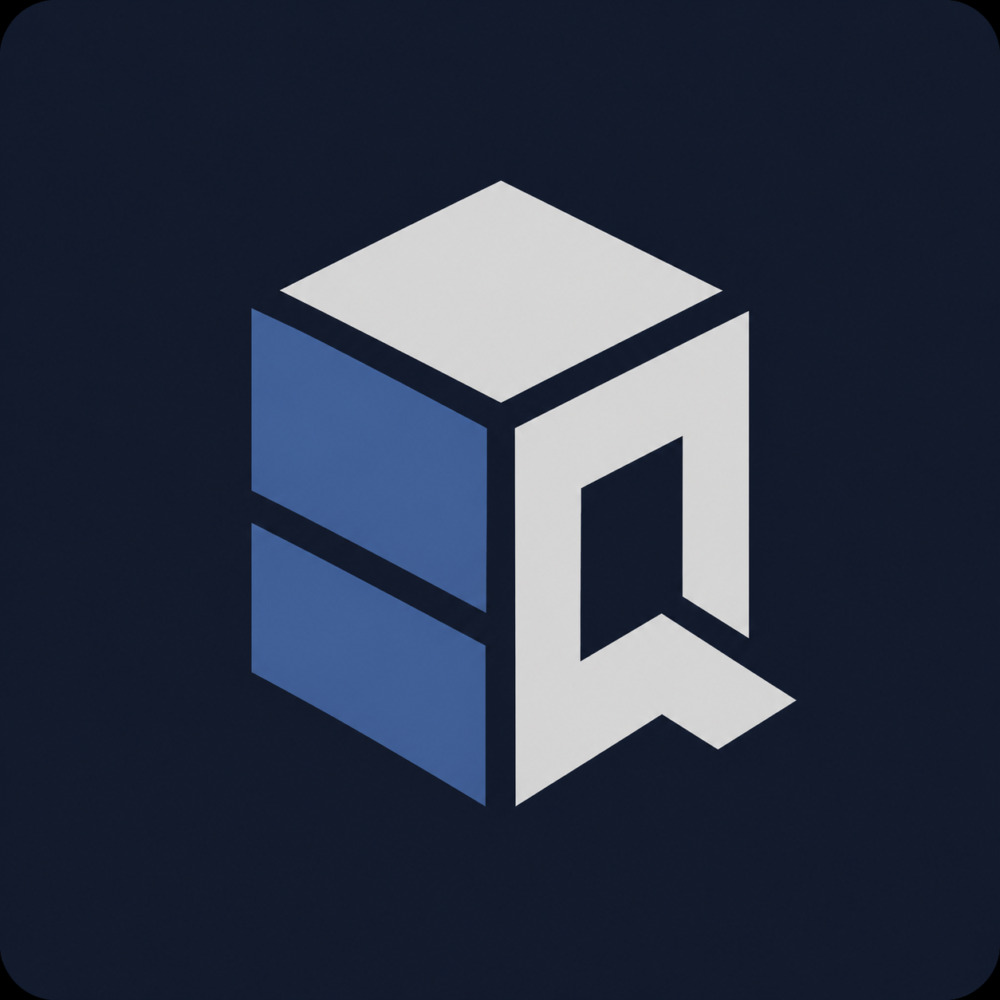
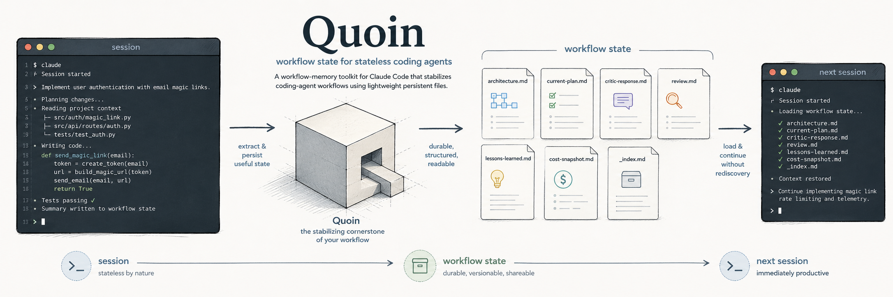

<p align="center">
  
</p>

# Quoin

**Workflow state for stateless coding agents.**

A workflow memory toolkit for Claude Code that structures your coding agent workflow using lightweight persistence files — so every session starts informed and every decision is tracked.

## What is Quoin?

Quoin gives Claude Code a disciplined engineering partner: planning, architecture review, quality gates, cost discipline, and institutional memory — across sessions, tasks, and team members.

Without Quoin, each Claude session starts cold. With Quoin, sessions share accumulated knowledge through structured artifacts: plans, critic reviews, session state, lessons learned, and a cost ledger.

## Why Quoin?

- **Cost discipline** — §0 model dispatch preamble routes each skill to the right tier (Haiku/Sonnet/Opus). `/cost_snapshot` shows live spend. `ccusage` fallback tracks every session.
- **Planning rigor** — `/thorough_plan` runs a plan→critic→revise convergence loop before a single line of code is written.
- **Audit trail** — every phase produces a structured artifact: `architecture.md`, `current-plan.md`, `critic-response-N.md`, `review-N.md`, `cost-ledger.md`.
- **Six stages of foundation** — stages 1–6 of the Quoin foundation hardened the system: §0 dispatch preamble (1), ccusage fallback (2), stage-subfolder path resolution (3), architect Phase 4 critic loop (4), native Haiku summarizer (5), and this rebrand + QUICKSTART relocation (6).

## Install

```bash
git clone https://github.com/FourthWiz/quoin
cd quoin
bash quoin/install.sh
```

> **Note:** GitHub auto-redirects from the old `FourthWiz/claude_dev_workflow` URL — existing clones continue to work.

## 30-Second Start

```
/init_workflow   ← one-time project bootstrap
/architect       ← design the solution
/thorough_plan   ← converge on a plan with critic review
/implement       ← write the code (explicit — you decide when)
/review          ← verify implementation against the plan
/end_of_task     ← push the branch (explicit — you decide when to ship)
```

## Skills

### Planning & Architecture

| Command | Model | What it does |
|---------|-------|-------------|
| `/architect` | Opus | Deep architectural analysis; internal Phase 4 critic loop |
| `/plan` | Opus | Detailed implementation plan (single-pass) |
| `/thorough_plan` | Opus | Triages task size; runs plan→critic→revise convergence loop |
| `/critic` | Opus | Reviews a plan for gaps, risks, integration issues |
| `/revise` | Opus | Revises plan from critic feedback (strict/Large mode) |
| `/revise-fast` | Sonnet | Revises plan from critic feedback (Medium mode, cost-efficient) |

### Implementation & Review

| Command | Model | What it does |
|---------|-------|-------------|
| `/implement` | Sonnet | Writes code from the plan (explicit command only) |
| `/review` | Opus | Verifies implementation against the plan; production-ready check |
| `/gate` | Sonnet | Automated quality checkpoint between phases; requires your approval |
| `/rollback` | Sonnet | Safely undoes an implementation phase or specific tasks |

### Session Lifecycle

| Command | Model | What it does |
|---------|-------|-------------|
| `/init_workflow` | Opus | One-time project bootstrap — creates `.workflow_artifacts/`, runs `/discover` |
| `/discover` | Opus | Scans all repos; maps architecture, dependencies, git log |
| `/start_of_day` | Haiku | Morning briefing — restores context from daily cache |
| `/end_of_day` | Haiku | Saves session state; promotes insights to daily cache |
| `/end_of_task` | Sonnet | Pushes branch, captures lessons, marks task complete (explicit only) |

### Utilities

| Command | Model | What it does |
|---------|-------|-------------|
| `/run` | Opus | End-to-end pipeline orchestrator; pauses at each gate |
| `/cost_snapshot` | Haiku | Live cost: today, lifetime, per-task breakdown |
| `/triage` | Haiku | Routes your request to the right skill |
| `/weekly_review` | Haiku | Aggregates the week's progress into a structured review |
| `/capture_insight` | Haiku | Logs a pattern or gotcha to the daily scratchpad |
| `/expand <path>` | Sonnet | Re-renders a terse workflow artifact in readable English |

## Architecture



Each Claude session is stateless by nature. Quoin bridges sessions using structured file artifacts under `.workflow_artifacts/`. Skills read these files at startup (session bootstrap) and write them on completion — so the next session, whether in 5 minutes or 5 days, picks up exactly where you left off.

For full rules, model assignments, artifact formats, and cost-tracking conventions, see [`quoin/CLAUDE.md`](quoin/CLAUDE.md).

## Cost & Model Discipline

Every Quoin skill declares a model tier (`haiku`, `sonnet`, `opus`). When invoked from a session running on a more expensive model, the skill self-dispatches via the `Agent` tool to its declared tier (§0 model dispatch preamble).

- Fails gracefully: if dispatch is unavailable, the skill proceeds at the current tier with a one-line warning — never aborts your invocation.
- Tracked: every session appends a row to `cost-ledger.md`. `/cost_snapshot` reads it live. `ccusage` is the fallback if the ledger is unavailable.
- Three artifact tiers: Tier 1 (always English — CLAUDE.md, reviews, architectures), Tier 2 (English + side-file), Tier 3 (terse; use `/expand` to read).

## Typical Flows

**Large feature (full pipeline):**
```
/discover → /architect → /thorough_plan large: ... → /implement → /review → /end_of_task
```

**Medium task (default):**
```
/thorough_plan add caching layer → /implement → /review → /end_of_task
```

**Small bug fix:**
```
/thorough_plan small: fix null pointer in auth handler → /implement → /review → /end_of_task
```

**Start / end of day:**
```
/start_of_day          ← morning: restores context, checks git state
/end_of_day            ← evening: saves state, consolidates insights
```

## Documentation

- [`quoin/QUICKSTART.md`](quoin/QUICKSTART.md) — command reference table (21 skills)
- `<your-quoin-clone>/Workflow-User-Guide.html` — interactive walkthrough with scenarios (open in browser)
- [`quoin/CLAUDE.md`](quoin/CLAUDE.md) — full workflow rules, model assignments, artifact formats

## Contributing

Bug reports and PRs welcome. The workflow is its own guinea pig — all Quoin development uses Quoin.

## License

MIT
