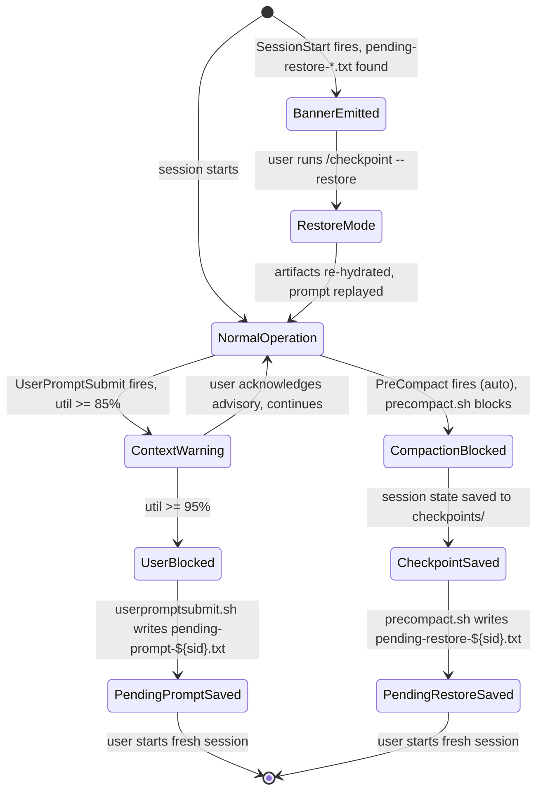

# Sentinel Lifecycle — Stage 2 (pending-prompt + pending-restore)

Stage 2 introduces two sentinel file types that together form the session-save/restore
flow across context threshold events. This document describes the full lifecycle,
the session-id discriminant, and recovery paths.

## Sentinel files

| File pattern | Written by | Read by | Purpose |
|---|---|---|---|
| `pending-prompt-${session_id}.txt` | `userpromptsubmit.sh` (block branch) | `/checkpoint --restore` | Saves the user's prompt that was blocked so it can be replayed in a fresh session |
| `pending-restore-${session_id}.txt` | `precompact.sh` (auto-compaction block) OR `/checkpoint` save mode | `sessionstart.sh`, `/checkpoint --restore` | Points to the checkpoint file path; triggers the restore banner on next session start |

Both files live in `.workflow_artifacts/memory/` (not in git — see note at end).

## State machine



ASCII state machine (for viewers without mermaid support):

```
[Normal operation]
      |
      | UserPromptSubmit fires at ≥85% util
      v
[Context warning advisory] → user continues → [Normal operation]
      |
      | util ≥ 95%
      v
[User prompt BLOCKED]
      | userpromptsubmit.sh writes pending-prompt-${sid}.txt
      | (contains the user's blocked prompt)
      v
[User starts fresh session]
      |
      | SessionStart fires; no pending-restore found
      v
[SessionStart: no banner] ← user manually /checkpoint
      |
      | /checkpoint writes pending-restore-${sid}.txt → checkpoint file
      v
[User starts ANOTHER fresh session]
      |
      | SessionStart fires; pending-restore-${sid}.txt found
      v
[Banner emitted: "Pending restore detected"]
      |
      | user runs /checkpoint --restore
      v
[Restore: artifacts re-hydrated + pending-prompt replayed]
      |
      | Both sentinels consumed and deleted
      v
[Normal operation resumed]

COMPACTION BRANCH:
[Normal operation]
      | auto-compaction triggers (no /compact from user)
      | precompact.sh fires → saves checkpoint to checkpoints/
      | → writes pending-restore-${sid}.txt
      | → emits {"decision": "block"} → compaction blocked
      v
[User starts fresh session]
      | SessionStart → banner (pending-restore found)
      v
[User runs /checkpoint --restore → resumes]
```

## Session-id discriminant (CRIT-3)

Both sentinel filenames include `${session_id}` from the harness hook stdin:

- `pending-prompt-${session_id}.txt` — each concurrent session gets its OWN file.
- `pending-restore-${session_id}.txt` — the restore lookup prefers the current session's file.

**Why this matters:** Without session-id scoping, two concurrent Claude sessions writing
to the same `pending-prompt.txt` would race (last-writer-wins), and the restored prompt
in session B could be session A's prompt. The session-id discriminant makes concurrent
fires completely safe — each session's sentinel is isolated.

**Restore-mode session-id matching policy:**
1. **Current-session match:** `/checkpoint --restore` and `sessionstart.sh` first look for
   `pending-restore-${current_session_id}.txt`. If found, use it directly.
2. **mtime-most-recent fallback:** If no current-session match exists (e.g., the user opened
   a brand-new session that has never had a pending-restore), fall back to the
   **mtime-most-recent** `pending-restore-*.txt` via `ls -t ... | head -1`.
   — NOT lexicographic order: UUIDv4-shaped session_ids have no time-ordering, so lex
   order would pick a pseudo-random historical file. mtime order picks the most recent
   compaction-block or /checkpoint save, which is almost always the right one.
   — A mismatch warning is emitted when the fallback is used.

## Stale sentinel sweep

`sessionstart.sh` sweeps files older than `$QUOIN_STALE_SENTINEL_DAYS` (default 7 days)
on every session start:

```sh
find .workflow_artifacts/memory/ -maxdepth 1 -name 'pending-prompt-*.txt' -mtime +7 -delete
find .workflow_artifacts/memory/ -maxdepth 1 -name 'pending-restore-*.txt' -mtime +7 -delete
```

This bounds worst-case pile-up if users never run `/checkpoint --restore` and just let
sessions accumulate. Long-lived sessions (e.g., a week-long task branch) can extend the
threshold via `QUOIN_STALE_SENTINEL_DAYS=14`.

## Successful-compaction stale pending-restore

If the harness fires auto-compaction DESPITE `precompact.sh` blocking it (V-01 demoted
result — the block signal may not always halt compaction in all harness versions), the
`pending-restore-${session_id}.txt` written by the hook may persist after compaction
completes. On the NEXT session start, `sessionstart.sh` will surface the banner — this
is intentional. The user's checkpoint is still valid and recoverable. If not desired,
the user can `rm .workflow_artifacts/memory/pending-restore-${session_id}.txt`.

If a future T-00 schema-diff reveals a post-compaction signal (a harness-emitted stdin
field after successful compaction), `precompact.sh` Step 5 would auto-delete the sentinel.
Until then, the sentinel may remain stale after a successfully-compacted session.

## Recovery paths

| Scenario | Recovery action |
|---|---|
| User killed the terminal mid-block (prompt lost) | Run `/checkpoint --restore` in fresh session; pending-prompt may not exist if the hook was killed before write completed |
| Sentinel files pile up over many sessions | `rm .workflow_artifacts/memory/pending-prompt-*.txt .workflow_artifacts/memory/pending-restore-*.txt` OR wait for stale sweep after 7 days |
| Wrong session-id surfaced (mismatch warning) | Review the surfaced content; use `[y/n/delete]` to accept, skip, or delete the stale file |
| Checkpoint file is corrupt | `/checkpoint --restore` surfaces the raw content with a "manual recovery" prompt; sentinel is preserved for manual inspection |
| Want to allow auto-compact in a session | `export CLAUDE_ALLOW_COMPACT=1` or create `.allow-compact` in the project cwd |

## Note: sentinel files must not be tracked in git

`pending-prompt-*.txt` and `pending-restore-*.txt` are ephemeral runtime state.
They MUST be excluded from version control. The project's `.gitignore` should include:

```
.workflow_artifacts/memory/pending-prompt-*.txt
.workflow_artifacts/memory/pending-restore-*.txt
```

(Checkpoint files under `.workflow_artifacts/memory/checkpoints/` are similarly
ephemeral and should be gitignored unless the team explicitly wants to share them.)
